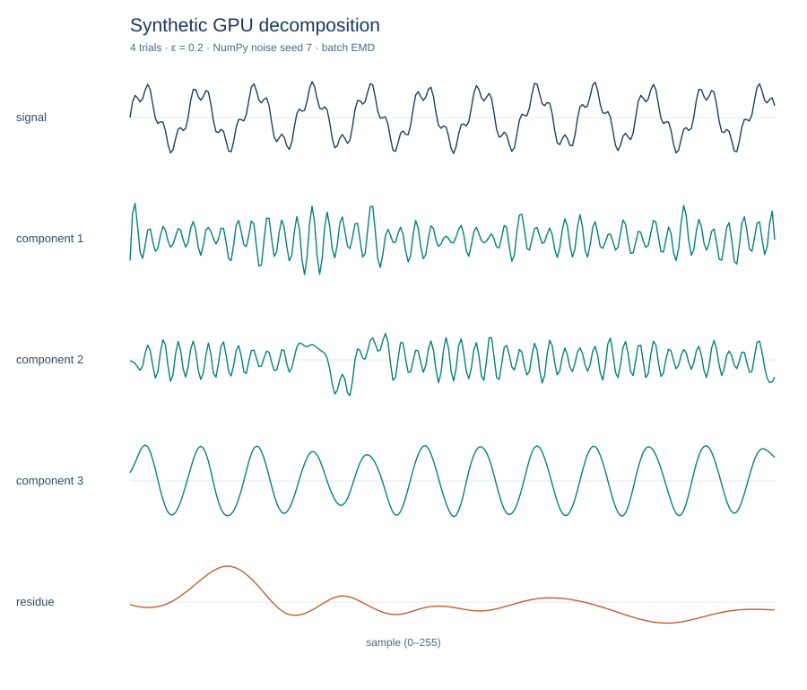
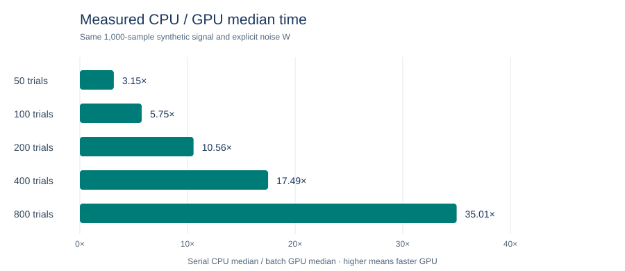

# ICEEMDAN GPU

[](LICENSE)
[](https://github.com/KimiK1983/iceemdan-gpu/actions/workflows/cpu-surrogate.yml)

An importable CUDA implementation of **Improved Complete Ensemble Empirical Mode Decomposition with Adaptive Noise** (ICEEMDAN). Install as `iceemdan-gpu`; import `iceemdan_cupy`. It has a scalar GPU reference route (`batch_emd=False`, the default), a supported accelerated route (`batch_emd=True, graph_control=False`), and an experimental graph route (`graph_control=True`).

[Install and use](#install-and-use) · [Reproducibility](#reproducibility) · [Public recordings](#public-recordings) · [Limits](#limits) · [Español](README.es.md)



*Original synthetic signal and GPU decomposition, generated by [`scripts/make_synthetic_figure.py`](scripts/make_synthetic_figure.py) with four explicit noise trials. This is neither a paper figure nor a clinical recording.*

## Install and use

Requires Python 3.13, NumPy 2, CuPy `cupy-cuda12x==14.2.0`, a compatible NVIDIA GPU and driver, and discoverable CUDA 12 Toolkit libraries. On Windows, set `CUDA_PATH` to the installed Toolkit if CuPy cannot locate its DLLs. From a clone:

```bash
python -m pip install .
```

Install the published `v0.2.0` release from GitHub with `python -m pip install "git+https://github.com/KimiK1983/iceemdan-gpu.git@v0.2.0"`.

```python
import cupy as cp
from iceemdan_cupy import ICEEMDAN, to_numpy

t = cp.arange(1000, dtype=cp.float64) / 100
x = cp.sin(2 * cp.pi * 2 * t) + 0.4 * cp.sin(2 * cp.pi * 7 * t)
model = ICEEMDAN(trials=100, epsilon=0.2, seed=42,
                 batch_emd=True, graph_control=False)
parts = model(x, T=t)
imfs, residue = model.get_imfs_and_residue()
host_parts = to_numpy(parts)
```

The final output row is always the residue. Extraction does not certify that a component is a structural mode or an exact IMF. CPU/GPU comparisons use the same explicit `noise=W` matrix because their internal random generators differ.

## Reproducibility

The [500 matched CPU/GPU rows](evidence/colominas_500_pairs.jsonl), [independent audit](evidence/colominas_500_audit.json), and [separate five-size benchmark](evidence/benchmark_cpu_batch_5_sizes.json) are versioned. The audit passed **500/500** ordered pairs with 100 seeds at each ensemble size (50, 100, 200, 400, 800). The maximum component difference was 4.44 × 10⁻¹⁶; discrete diagnostics matched exactly. These results cover one 1000-sample synthetic signal and this implementation's ICEEMDAN arm. They do not reproduce the authors' MATLAB random draws or all methods in the paper.

| Trials | CPU serial median (s) | GPU batch median (s) | CPU/GPU ratio |
|---:|---:|---:|---:|
| 50 | 4.156 | 1.318 | 3.154 |
| 100 | 8.479 | 1.475 | 5.750 |
| 200 | 15.662 | 1.483 | 10.559 |
| 400 | 31.473 | 1.800 | 17.490 |
| 800 | 66.987 | 1.913 | 35.010 |



*On the published 1,000-sample synthetic signal and Windows 11 / RTX 5080 Laptop protocol, GPU batch was 3.15×–35.01× faster than serial CPU. Generated from the [versioned benchmark](evidence/benchmark_cpu_batch_5_sizes.json) by [`scripts/make_benchmark_figure.py`](scripts/make_benchmark_figure.py); see the [protocol and limits](docs/COLOMINAS_500_RESULTS.md).*

Each timing is a median of three complete runs after one warmup per route on the stated machine. The [paper figure map](docs/PAPER_REPRODUCIBILITY.md) records which of Figures 1–15 have evidence, candidate sources or unresolved inputs.

## Public recordings

Optional scripts fetch versioned [Keele](https://zenodo.org/records/3921794) and [CUDB 1.0.0](https://physionet.org/content/cudb/1.0.0/) archives and analyze candidate windows on the GPU. The Keele record states noncommercial use; CUDB has its own attribution terms. Review those terms before use. Downloads go to ignored `data/`; regenerated metrics, optional arrays and optional plots go to ignored `outputs/`:

```bash
python -m scripts.fetch_public_data keele
python -m scripts.fetch_public_data cudb
python -m scripts.analyze_keele
python -m scripts.analyze_cudb
```

The small, executed GPU metric files are [Keele](evidence/public_data_20260928/keele/metrics.json) and [CUDB `cu01`](evidence/public_data_20260928/cudb/metrics.json). They use 100 trials, `epsilon=0.2`, seed 0, and the supported batch route. The [figure map](docs/PAPER_REPRODUCIBILITY.md) ties each window to the paper comparison and records its limits. Add `--plot-local` for a plot kept in `outputs/`; this needs Matplotlib separately. The Keele and CUDB windows are candidate matches, not confirmed paper sources or clinical validation. No biomedical waveform, plot or patient array is versioned.

## Limits

Local CUDA validation used Windows 11, Python 3.13.14, CuPy 14.2.0, CUDA runtime 12.9, and an RTX 5080 Laptop GPU. Other platforms are unverified. The batched path checks a lower bound on device memory before allocation; it cannot guarantee a given input fits in VRAM. See [batch limits](docs/BATCHED_EMD_GPU.md) and [validation status](docs/VALIDATION_STATUS.md). The `graph_control=True` route is experimental.

Run the focused CUDA checks with `python -m pytest -q tests/test_07_batched_extrema.py tests/test_09_numeric_contracts.py`. A CPU surrogate checks Python logic only, not CUDA. Copyright 2025 Javier F. Santamaria and contributors. Code license: [Apache-2.0](LICENSE); see [third-party notices](THIRD_PARTY_NOTICES.md). Dataset rights are separate.
